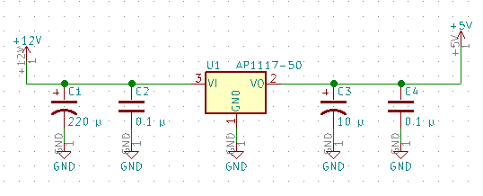

# AMS1117 Voltage Regulator board

Circuit board for AMS1117 low dropout voltage regulator





## Project Files

```
.
├── AMS1117.3dshapes       \\ 3D models of components
├── AMS1117_datasheet.pdf  \\ AMS1117 datasheet
├── AMS1117.kicad_pcb      \\ Board layout
├── AMS1117.lib            \\ Schematic library
├── AMS1117.pretty         \\ Footprints
├── AMS1117.pro            \\ KiCad project
├── AMS1117.sch            \\ Schematic
├── images                 \\ Images
└── README.md              \\ This file
```
